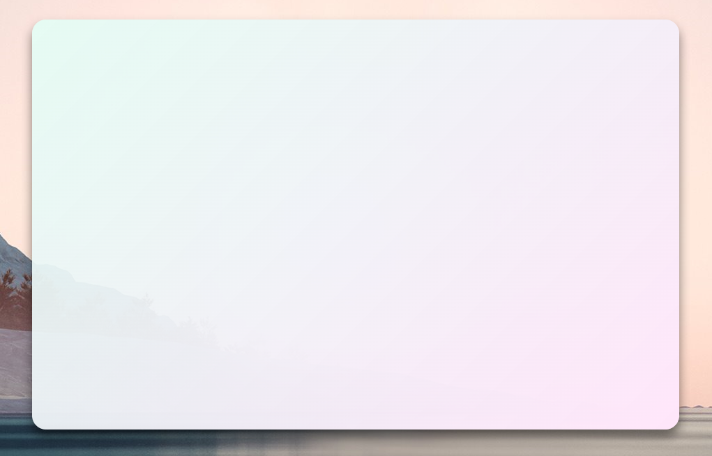

#Transparency Style Forms[^1]

[^1]: Transparent form style only supports WinFormium Business Edition

## Overview

The transparent form style means that the entire form can be transparent, so that the irregular shape of the form can be realized depending on the front-end design. The transparent form style requires turning on CEF's off-screen rendering mode. CEF synthesizes the rendered bitmap with the current form, so that the transparent effect of the form can be achieved.

You can use the extension method `UseTransparencyForm` of `WindowStyleBuilder` to set the form to a transparent form style. The sample code is as follows:

```csharp
protected override FormStyle ConfigureWindowStyle(WindowStyleBuilder builder)
{
     var style = builder.UseTransparencyForm();
     return style
}
```

## RenderType property

The transparent form style provides three rendering modes. You can set the rendering mode through the `RenderType` property. The property values are as follows:

| Property value    | Description                                                                          |
| ----------------- | ------------------------------------------------------------------------------------ |
| Skia              | Use SkiaSharp for bitmap rendering and LayerdWindow to implement transparent forms.  |
| Direct2D          | Use Direct2D for bitmap rendering and LayerdWindow to implement transparent windows. |
| DirectComposition | Use DirectComposition for bitmap rendering and transparent forms.                    |

The performance of the three rendering modes from high to low is: DirectComposition > Direct2D > Skia, but DirectComposition requires Windows 8 or higher system to use. If your application needs to be compatible with Windows 7 system, please use the other two Rendering mode. The default value of the `RenderType` property is `RenderType.Skia`.

## ExcludeBorderArea property

The `ExcludeBorderArea` property is used to set the excluded area of the form border. The area within the excluded area will not respond to the mouse's HitTest event. You can simply understand its purpose from the example picture below. The value of the `ExcludeBorderArea` property is of `Padding` type. You can use the `Padding` type property to set the size of the excluded area. The sample code is as follows:

**C#**

```csharp
protected override FormStyle ConfigureWindowStyle(WindowStyleBuilder builder)
{
     var style = builder.UseTransparencyForm();
     style.ExcludeBorderArea = new Padding(15, 25, 15, 25);
     return style
}
```

**CSS**

```css
body{
   background-color: transparent;
   padding: 25px 15px 25px 15px;
}

...
```

The value of the `ExcludeBorderArea` property is closely related to the design of the front-end. You can set the size of the excluded area according to the design of the front-end. The picture below is a simple example. In the css of the front-end page, the `padding` attribute of the body element is used to exclude the area of the shadow effect of the div element from the form border. When setting the projection attribute of the div element, according to The offset and blur radius of the shadow are used to calculate the value of the `padding` property to ensure that the excluded area can accommodate the entire shadow effect.

After setting the excluded area on the front end, you also need to set the value of the `ExcludeBorderArea` property in the C# code. This value is the same as the `padding` value of the front-end container. This ensures that the mouse in this area will not respond to the HitTest event. After excluding this area, WinFormium will automatically calculate the correct operable form size.



As shown in the picture above, the size of the excluded area is 25px 15px 25px 15px. This value is the same as the `padding` value of the front-end container, so when the mouse is located in the projected part, the HitTest event will not be triggered. When the mouse is close to this `padding` value edge , the mouse will automatically change into a mouse style that can resize the form.

## Notes on transparent form styles

When using the transparent form style, although an interface for changing the form size in real time is provided (this feature is not supported in previous NanUI versions), due to the use of off-screen rendering mode, there will be errors when resizing the form. There is a certain amount of lag, which is caused by CEF needing to re-render the bitmap and combine it with the form. This problem cannot be avoided until CEF itself is solved. Therefore, it is recommended that you try to avoid using transparent form styles that can change the size of the form.

To turn off the resizability feature of the transparent form style, you can set the `Resizable` property to `false` so that the user cannot drag the form border to resize the form.

```csharp
protected override FormStyle ConfigureWindowStyle(WindowStyleBuilder builder)
{
     var style = builder.UseTransparencyForm();
     style.Resizable = false;
     return style
}
```

## See also

- [Forms](./overview.md)
- [Form Features](./Form-Features.md)
- [Forms without Titlebar](./Forms-Without-Titlebar.md)
