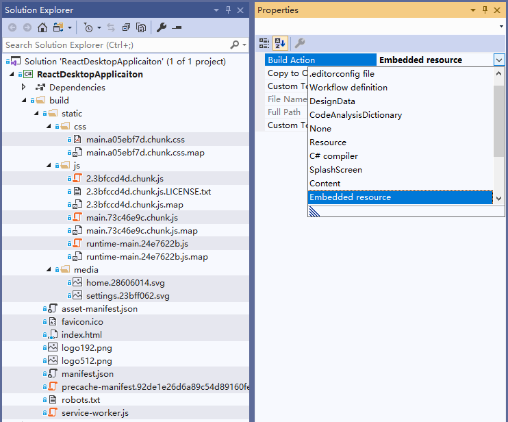

#Embedded File Resources

## Overview

Embedded file resources refer to embedding file resources into an assembly. The advantage of this is that the front-end file resources can be packaged into any assembly for easy distribution and use. WinFormium uses embedded file resource handlers to manage embedded file resources. You can package multiple embedded file resource handlers in the same assembly and specify different URLs for them.

## Embed resources

First, you need to copy the folders containing the front-end resources into the project of the WinFormium application through the Solution Manager and prepare appropriate names for these folders. For example, using a React project created with `Create-React-App`, then you can copy the `build` directory into the WinFormium application's project. If you created a Vue project using the `Vue CLI`, you can copy the `dist` directory into the WinFormium application's project.

In the second step, you need to delete non-essential files from this directory to reduce the size of the assembly, such as `map` files, `manifest` files, etc. Of course, you can also avoid generating these files by modifying the packaging script in the `package.json` file of the front-end project. Please refer to the relevant documentation for specific operations.

Next, you need to embed the files in these folders into the assembly. In Visual Studio, right-click on these resource files, select "Properties", and select "Embedded Resources" in "Build Action". In this way, the files in these folders will be embedded in the assembly.

If your project is a .NET Framework type project and does not enable the SDK-style project file format, then you need to select each file that needs to be embedded (you can hold down Ctrl and click on the file to achieve multi-selection) and in the properties window Select "Embedded Resource" in "Build Action".



If your project is in an SDK-style project file format, you can double-click the project file and add the following code to the project file to specify the files that need to be embedded:

```xml
<ItemGroup>
     <EmbeddedResource Include="build\**\*" />
</ItemGroup>
```

## Register embedded file resource handler

You can use `AppBuilder` to register the embedded file resource handler during the WinFormium application creation phase, or you can use `ConfigureServices` of the `WinFormiumStartup` class to configure the service to register the embedded file resource control during the WinFormium application configuration phase. device.

### Registration example

**AppBuilder**

```csharp
class Program
{
     [STAThread]
     static void Main(){
         var builder = WinFormiumApp.CreateBuilder();

         var app = builder
         //...
         .UseEmbeddedFileResource(new EmbeddedFileResourceOptions
         {
             Scheme = "http",
             DomainName = "embedded.app.local",
             ResourceAssembly = typeof(Program).Assembly,
             EmbeddedResourceDirectoryName = "build",
         })
         .build();

         app.Run();

     }
}
```

Use the extension method `UseEmbeddedFileResource` of `AppBuilder` to register the embedded file resource handler. This method accepts a parameter of type `EmbeddedFileResourceOptions`. You can use this parameter to specify the URL address of the embedded file resource handler and the location where the resource is located. Folder names where assemblies and resources are located, etc.

**WinFormiumStartup**

```csharp
class MyApp : WinFormiumStartup
{
     //...

     public override void ConfigureServices(IServiceCollection services)
     {
         //...
         services.AddEmbeddedFileResource(new EmbeddedFileResourceOptions
         {
             Scheme = "http",
             DomainName = "embedded.app.local",
             ResourceAssembly = typeof(Program).Assembly,
             EmbeddedResourceDirectoryName = "build",
         });
         //...
     }

}
```

Use the extension method `AddEmbeddedFileResource` of `WinFormiumStartup` to register the embedded file resource handler. This method accepts a parameter of type `EmbeddedFileResourceOptions`. You can use this parameter to specify the URL address of the embedded file resource handler and the location where the resource is located. Folder names where assemblies and resources are located, etc.

### EmbeddedFileResourceOptions

Parameters of type `EmbeddedFileResourceOptions` are used to specify the URL address of the embedded file resource handler, the assembly where the resource is located, the name of the folder where the resource is located, etc. It contains the following properties:

| Property name                 | Type     | Description                                                                                                                                                                                                                                                      |
| ----------------------------- | -------- | ---------------------------------------------------------------------------------------------------------------------------------------------------------------------------------------------------------------------------------------------------------------- |
| Scheme                        | string   | Url protocol name of the embedded file resource handler, such as `http`, `https`, `file`, etc.                                                                                                                                                                   |
| DomainName                    | string   | Url domain name of the embedded file resource handler, for example `embedded.app.local`.                                                                                                                                                                         |
| ResourceAssembly              | Assembly | The assembly in which the embedded file resource handler resides. If your resource is embedded in the current assembly, you can use `Assembly.GetEntryAssembly()` or `Assembly.GetExecutingAssembly()` to get the assembly that currently contains the resource. |
| EmbeddedResourceDirectoryName | string   | The name of the folder where the embedded file resource handler is located. For example, if your resource is in the `wwwroot\build` folder of the project directory, then you need to specify `wwwroot\build` here.                                              |
| DefaultNamespace              | string   | The namespace of the folder name where the embedded file resource handler is located. Normally you do not need to specify a default namespace, only if your assembly's default namespace is inconsistent with the assembly name.                                 |

## Use embedded file resources

After you register an embedded file resource handler, you can use these resources in your WinFormium application. For example, if you register an embedded file resource handler with the URL address `http://embedded.app.local`, then you can use `http://embedded.app.local` in your WinFormium application. ` Come to access resources.

## See also

- [Overview](./overview.md)
- [Local File Resources](./File-Resources.md)
- [Data Resources](./Data-Resources.md)
- [Proxy Resources](./Proxy-Resources.md)
